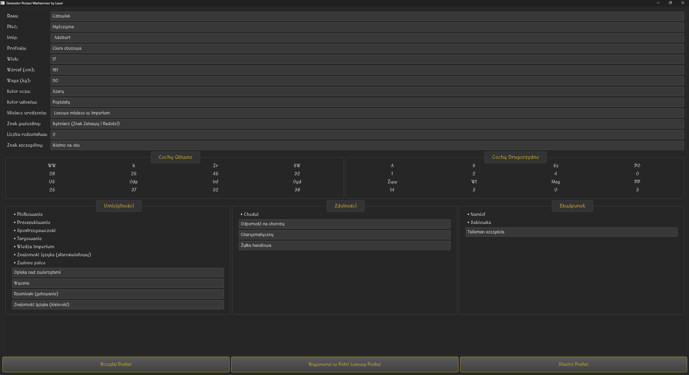
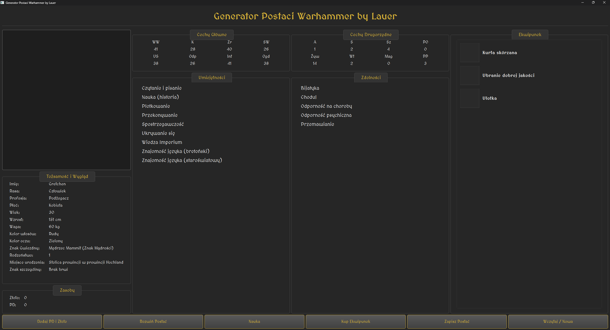
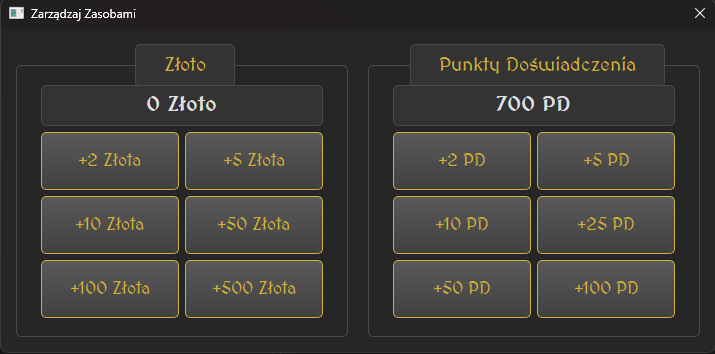
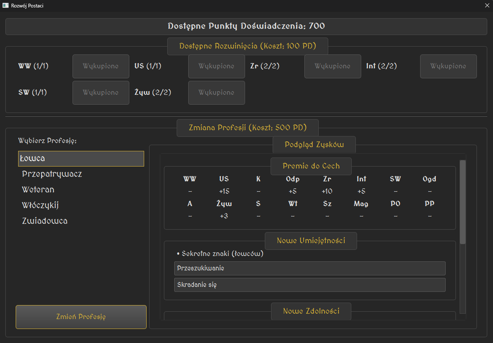
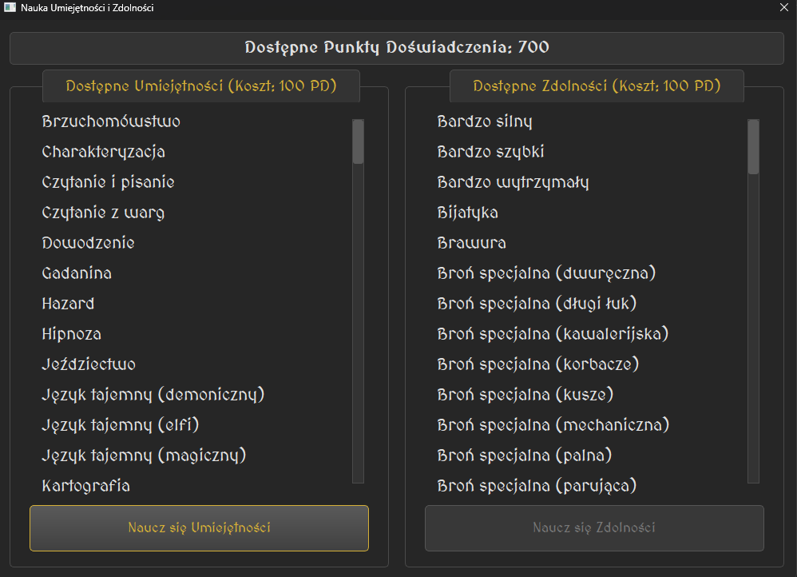
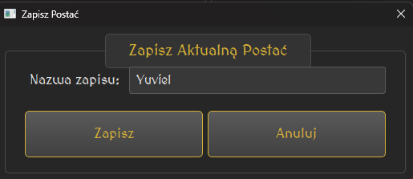
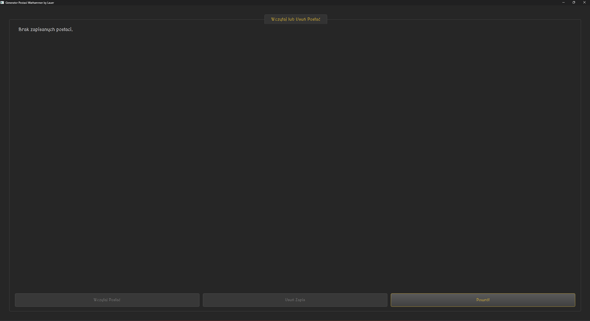

Pewnie! Oto odświeżona i bardziej przejrzysta wersja całej dokumentacji, z ulepszonym formatowaniem i dodanymi zrzutami ekranu dla każdej funkcji.

***

# Dokumentacja Projektu: Generator Postaci Warhammer

## 1. Instalacja i Uruchomienie

Aby rozpocząć pracę z generatorem, postępuj zgodnie z poniższymi krokami, aby szybko i sprawnie przygotować aplikację do działania.

1.  **Pobierz Aplikację**
    Upewnij się, że masz wszystkie pliki projektu na swoim komputerze.

2.  **Zainstaluj Środowisko Python**
    Aplikacja wymaga zainstalowanego Pythona do poprawnego działania.

3.  **Zainstaluj Wymaganą Bibliotekę**
    Otwórz terminal lub wiersz poleceń i zainstaluj bibliotekę `PyQt6` za pomocą menedżera pakietów pip:
    ```bash
    pip install PyQt6
    ```

4.  **Uruchom Aplikację**
    W głównym folderze projektu wykonaj następującą komendę:
    ```bash
    python main.py
    ```

## 2. Przewodnik Użytkownika

### Okno Startowe: Kreator Postaci

Po uruchomieniu aplikacji wita Cię okno kreatora postaci, które jest Twoim punktem wyjścia do świata Warhammera.



Masz tutaj do wyboru trzy ścieżki:

*   **Tworzenie Ręczne:** Daje pełną kontrolę nad procesem tworzenia bohatera. Wybierz rasę, profesję i inne szczegóły, a formularz na bieżąco zaktualizuje podgląd statystyk. Idealne dla tych, którzy mają już konkretną wizję postaci. Po wszystkim kliknij **"Stwórz Postać"**.

*   **Wczytanie Postaci:** Jeśli kontynuujesz przygodę, użyj przycisku **"Wczytaj Postać"**, aby załadować zapisanego bohatera i wrócić do gry.

*   **Generowanie w Pełni Losowe:** Chcesz szybko zacząć lub szukasz inspiracji? Kliknij **"Wygeneruj w Pełni Losową Postać"**, a aplikacja w mgnieniu oka stworzy kompletną, gotową do gry postać.

### Główne Okno Postaci: Twoje Centrum Dowodzenia

Po stworzeniu lub wczytaniu bohatera, przejdziesz do jego głównej karty – centrum zarządzania wszystkimi aspektami postaci.



Ekran ten gromadzi wszystkie niezbędne informacje:
*   **Tożsamość i Wygląd:** Kluczowe dane definiujące Twojego bohatera.
*   **Cechy Główne i Drugorzędne:** Wszystkie atrybuty bojowe i pomocnicze.
*   **Umiejętności i Zdolności:** Zestawienie tego, co Twoja postać potrafi.
*   **Ekwipunek i Zasoby:** Twój dobytek – od złota po posiadany sprzęt.
*   **Wizualizacja Postaci:** Możesz spersonalizować kartę, dodając **zdjęcie bohatera** oraz **grafiki dla każdego przedmiotu** w ekwipunku.

### Panel Akcji: Dynamiczne Zarządzanie Postacią

Na dole ekranu znajduje się panel z przyciskami, który pozwala aktywnie zarządzać i rozwijać Twojego bohatera w trakcie rozgrywki.

---

#### **Zarządzanie Zasobami**

*   **Dodaj PD i Złoto**
    Umożliwia ręczne dodawanie Punktów Doświadczenia i złota zdobytych podczas sesji. To kluczowa funkcja do śledzenia postępów.
    

*   **Kup Ekwipunek**
    Wydawaj zgromadzone złoto na nowy pancerz, broń i inne przydatne przedmioty, aby lepiej przygotować się na przygody.
    

---

#### **Rozwój Postaci**

*   **Rozwiń Postać**
    W tym miejscu wydajesz Punkty Doświadczenia, aby zwiększać cechy główne postaci lub wykupić dostęp do nowej, bardziej zaawansowanej profesji.
    

*   **Nauka**
    Inwestuj PD w nowe umiejętności i zdolności, poszerzając wachlarz taktycznych możliwości swojego bohatera.
    

---

#### **Zarządzanie Sesją**

*   **Zapisz Postać**
    Zapisuje wszystkie postępy – zdobyte doświadczenie, nowy ekwipunek i rozwinięte statystyki. Dzięki temu możesz bezpiecznie zakończyć grę i wrócić do niej później.
    

*   **Wczytaj / Nowa**
    Przenosi Cię z powrotem do okna startowego, gdzie możesz wczytać inną postać lub rozpocząć tworzenie zupełnie nowego bohatera bez potrzeby restartowania aplikacji.
    